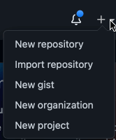
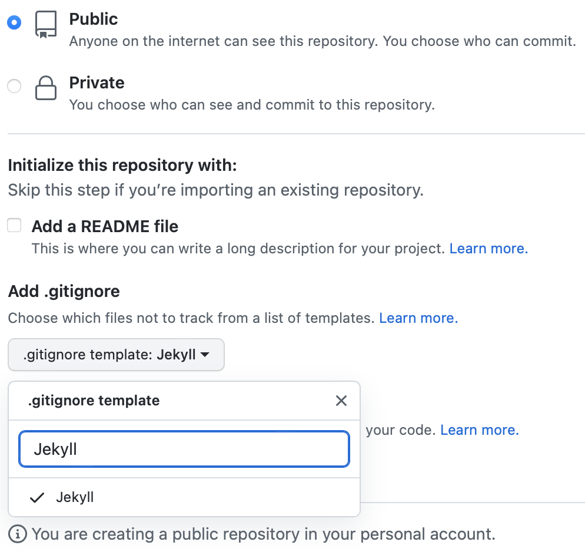
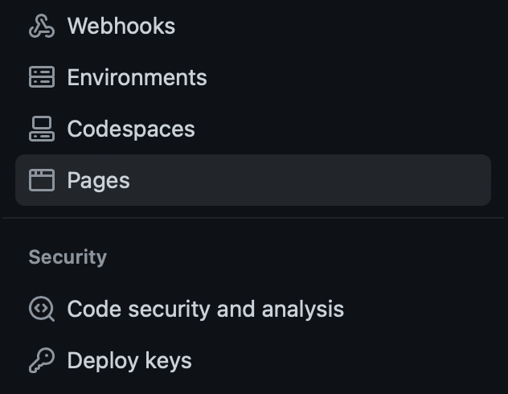
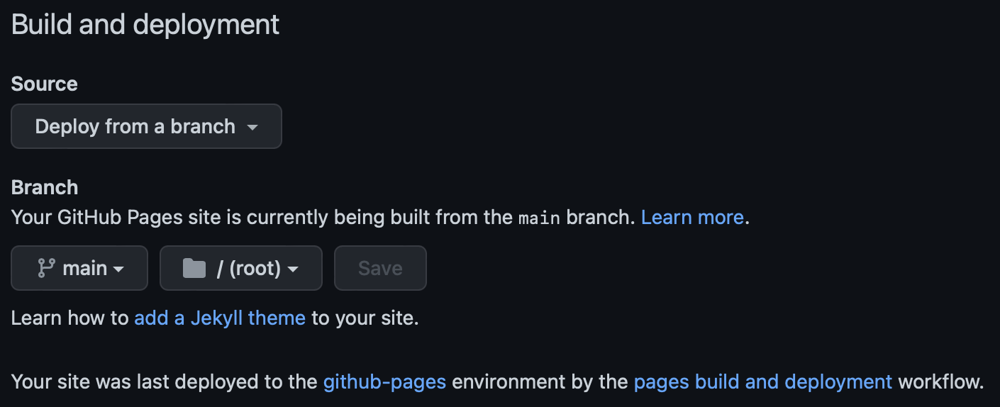
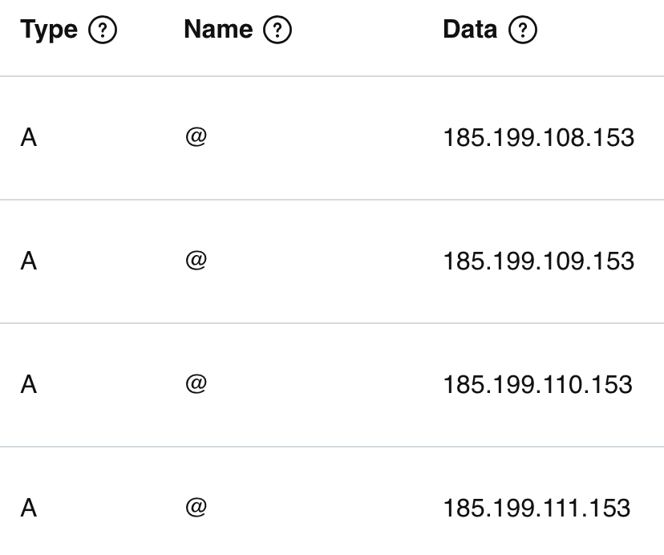

If you always wanted to start your blog and don't know where to start. Well, just follow this quick guide and by the end of this article, you'll have your own working blog live on internet (sounds easy right, well it is actually easy. Let's get to it!). 

In this guide, we'll go through the steps to bring our exciting blog to life (*yay!!*)
1. [Step 1](#host-on-github-pages) - Create [GitHub](https://github.com/) account (*in case you already don't have one*) and create a public repository to host our blog's code. (We'll use [GitHub Pages](https://pages.github.com/) to host our blog for **Free**, exciting right!).
2. [Step 2](#setup-and-configure-jekyll) - Set up [Jekyll](https://jekyllrb.com/) (a tool to generate static sites using markdown syntax) in your computer.
3. [Step 3](#optional-configure-custom-domain) - (By the way, this is an optional step) If you have your own domain, we'll configure DNS settings to point it to our newly created blog.

# Create `GitHub Pages` repository
- Create [GitHub](https://github.com/) account (*in case you already don't have one*).
- Create a new repository

&nbsp;&nbsp;&nbsp;&nbsp;&nbsp;&nbsp;&nbsp;&nbsp;&nbsp;&nbsp;
- Name your repository as **`<github-username>.github.io`** (*well this is important, other names won't work here.*)
- Set the visibility of this repository as `public` and choose `Jekyll` template for your `.gitignore` file as shown below.

&nbsp;&nbsp;&nbsp;&nbsp;&nbsp;&nbsp;&nbsp;&nbsp;&nbsp;&nbsp;{: width="300px"}

# Setup and configure Jekyll 
## Requirements
- [Ruby](https://www.ruby-lang.org/en/downloads/) version **2.5.0** or higher, including all development headers (check your Ruby version using `ruby -v`)
- [RubyGems](https://rubygems.org/pages/download) (check your Gems version using `gem -v`)
- [GCC](https://gcc.gnu.org/install/) and [Make](https://www.gnu.org/software/make/) (check versions using `gcc -v`,`g++ -v`, and `make -v`)

## Installation
For detailed install instructions, follow the guide for your operating system.
- [macOS](https://jekyllrb.com/docs/installation/macos/)
- [Ubuntu](https://jekyllrb.com/docs/installation/ubuntu/)
- [Other Linux](https://jekyllrb.com/docs/installation/other-linux/)
- [Windows](https://jekyllrb.com/docs/installation/windows/)

## Install Jekyll
After installing Ruby with chruby, let's install the latest `jekyll` and `bundle` gems:
```zsh
$ gem install jekyll bundler
```

## Create site with Jekyll
- Clone the newly created repository to your local computer. (see if you can give some link for cloning)
- Open terminal in the directory where you just cloned the github repository.
```zsh
$ cd REPOSITORY-NAME
# Changes the working directory
```
- Create new jekyll site by running following command
```zsh
$ jekyll new .
# "." tells jekyll utility to create new site in current directory
```
- Now, it's time to see our new blog in our local computer.
```zsh
$ bundle exec jekyll serve
```
- If everything went well then you should see the following output. Trying running the url `http://127.0.0.1:4000/`. If you're getting some error then try the next step. 
```zsh
    Server address: http://127.0.0.1:4000/
  Server running... press ctrl-c to stop.
```
- [Optional step] Open `<Parent Repo folder>/Gemfile` in text editor of your choice and and add following line.
```text
gem "webrick", "~> 1.7"
```
- [Optional step] Install the gems from Gemfile by running following command.
```zsh
$ bundle
```
- Commit your changes to git repo and push these changes to remote branch.

## GitHub pages - publish settings
- Go to [GitHub](https://github.com/) and open the repository that we created earlier and go to `Settings` tab as shown below.

&nbsp;&nbsp;&nbsp;&nbsp;&nbsp;&nbsp;&nbsp;&nbsp;&nbsp;&nbsp; 
- Go to `Pages` section.

&nbsp;&nbsp;&nbsp;&nbsp;&nbsp;&nbsp;&nbsp;&nbsp;&nbsp;&nbsp;{: width="200px"}
- Under the section `Build and deployment`, make sure to select `Source` as `Deploy from a branch`. Select `main` and `/root` in branch settings.

&nbsp;&nbsp;&nbsp;&nbsp;&nbsp;&nbsp;&nbsp;&nbsp;&nbsp;&nbsp;

Congratulations 👏, your blog is live at `https://<username>.github.io`

# [Optional] Configure custom domain
Well, if you already have your own domain or planning to have one, then following steps might interest you.
- Go to `Manage DNS` section of your domain provider.
- Add following DNS records with exact same values.

&nbsp;&nbsp;&nbsp;&nbsp;&nbsp;&nbsp;&nbsp;&nbsp;&nbsp;&nbsp;{: width="150px"}
- Add another record with `Type=CNAME`, `Name=www` and `Data=<username.github.io>`
- Under `Settings > Pages > Custom Domain` add your domain name (e.g. example.com) and click on `Save`.

That's it, we're done with setup here :) Your custom domain should now point to your newly created blog.

# Conclusion
I hope you're able to successfully set up your blog by following the instructions given in this post. Do let me know in comments, if you find it useful. I'll try my best to help with any issues that you might face during this setup.

Cheers folks!

# References
- https://jekyllrb.com/docs/step-by-step/01-setup/
- https://docs.github.com/en/pages/setting-up-a-github-pages-site-with-jekyll/creating-a-github-pages-site-with-jekyll